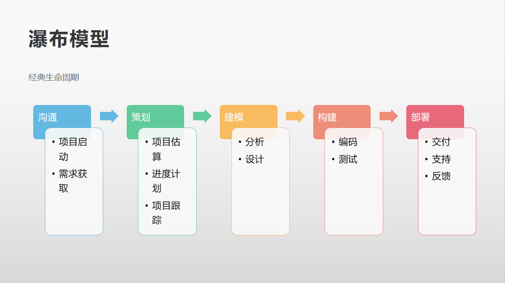
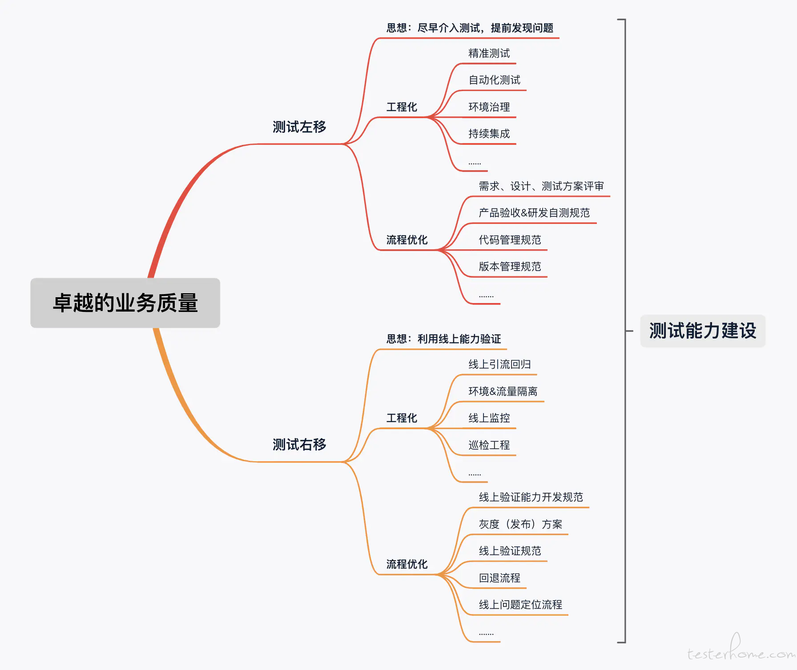

# 测试左移和测试右移

> 有时候，我会在想，为什么我把测试工作做得挺好的，线上环境还会出bug？这些bug可能是因为当初设计时就有的漏洞，也可能是部署不当带来的问题。测试就不能做点什么改变这种被动的现状吗？有，这就需要你践行测试左移和测试右移。

### 1.什么是测试的左移和右移

从瀑布模型中，我们可以看到，测试属于构建环节，介于建模和部署之间。如果你想改变测试被动的现状，让问题早发现早解决，而不是轮到测试的时候才发现，就要参与到软件开发各个环节，监控各个环节的实施，测试各个环节生成的文档。那么测试左移就是参与到图中左边的环节中，测试右移就是参与到途中右边的环节。

### 2.测试左移的实践

了解和评估需求，发掘需求的不合理之处，提供针对性的建议，提高需求的质量。

了解和评估产品设计方案，发现设计的漏洞，并及时反馈给产品人员，避免问题到了测试阶段才暴露出来，影响产品按时发布。

了解产品的技术实现，通过查看开发文档，接口文档等，执行静态测试发掘问题。

阿里巴巴的一些实践：

1. 参与需求评审，帮助开发理解需求
2. 参与架构、设计分析，提早预防问题
3. 践行BDD，TDD
4. 单元测试提案，接口测试提案
5. 提供模拟数据能力，测试工具
6. 制定提测标准，拒绝低质量代码
7. 回归测试自动化
8. 静态代码分析，单元测试覆盖率

### 3.测试右移的一些实践

软件一经发布，就要对线上日志监控和预警。及早发现问题，及早修复，将损失降到最低。而不是等用户反馈了，才去解决。如果等到用户反馈问题，说明问题影响反馈已经很大了。

灰度发布，数据隔离，线上监控，线上验收。当业务方由于环境等原因，有些功能必须在线上验收。线上验收的原则是尽可能的不要影响到原有功能和使用业务的用户，这个就需要做好很好的隔离，所以从研发一开始的设计就从线上可测性角度就需要考虑到这一点，功能做好隔离，数据做好隔离，一旦出现问题，我们有相对应的风险预案，如何清除脏数据，如何将功能降级等，前期的设计都要考虑好，发布完成以后我们还需要考虑运营层面的事情。

采集线上数据，包括业务数据和性能数据，建立一个健康的产品数据模型。业务数据可以通过数据挖掘，生成用户画像，有助于产品人员做出相应的决策，包括改进现有功能，开发新功能满足用户需求，砍掉某些不合适的功能等。性能数据，最直接的作用就是运维人员做出相应的硬件调整，包括硬件扩容，整合闲置资源等。也可以给架构师提供一些系统架构设计上的调整。

### 3. 结论

无论是测试左移还是测试右移，测试人员开始从质量控制转变成质量保证，从被动发现软件问题到主动提高软件质量，从团队的边缘人物转变成团队的活跃分子，这无疑是一件令人感到兴奋的事情。

### 4. 附

我发现了一篇极好的文章《论测试工程师的职责》，作者的观点是：

> 其实我作为测试工程师大部分的时间都是在做**测试设计**，**测试设计**体现一名测试工程师的产出，测试执行不一定需要测试工程师来做，但需要你做好的是在测试能力方面的建设，质量是整个团队的目标和责任，测试工程师就是专门为这个目标出谋划策的，我们认清出自己的职责，把自己的思维转换过来，把肉身转化成能力，把人力成本变成技术成本，这是作为测试工程师价值的体现。

想要知道作者是如何实现测试设计的，请移步参考文档2。文末感慨：珠玉在前，献丑与后，不甚惭愧。

### 参考文档：

1. 软件工程实践者的研究方法 [美]Roger S.Pressman著 郑人杰 马素霞 等译
2. 论测试工程师的职责，链接：https://testerhome.com/topics/23727
3. 测试左移和测试右移，链接：https://www.cnblogs.com/nbkhic/p/9279241.html
4. 测试左移：软件成功的秘诀，链接：https://www.jianshu.com/p/45dda78d82a7
5. 测试左移和开发赋能，链接：https://testerhome.com/topics/18856