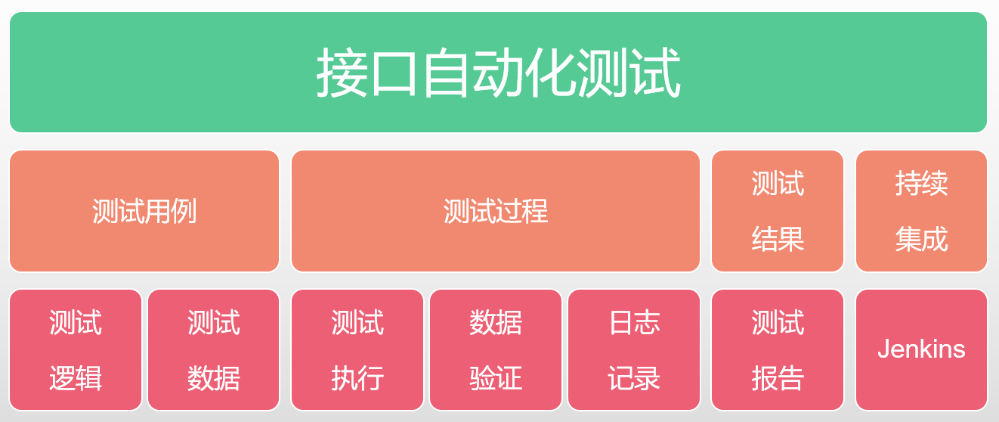

# 游戏接口测试自动化实践

> 来testhome一周了，发了两篇理论文章，就有人嫌我水，希望我来点干货。今天发一个干货，虽然我知道你们绝大多数人都不会用到，但是我可以秀操作啊！

[toc]

## 1.背景

### 1.0 作者背景

先说一下我的背景，上海某游戏公司QA，3年游戏测试经验，虽然工作时间不长，但是接手过一个大型的页游项目和一个在研手游项目，对接口自动化方面有一定的思考和技术沉淀。

### 1.1 游戏测试行业的现状

国内的游戏测试行业目前普遍的是功能测试走天下，偶尔出来个UI自动化测试就了不得了。众所周知，UI自动化开发和维护成本高，投入性价比很低，而游戏又是一种界面千奇百怪又元素布局纷繁复杂的软件，UI自动化更是得不偿失，即使上马了自动化测试项目，往往都是虎头蛇尾。

为什么其它互联网企业，自动化测试满天飞，游戏测试行业依然如此原始。据我的观察，游戏测试应该是落后外面5年的技术沉淀。可能游戏行业已经被踢出互联网行业，划归为传统软件开发领域了吧。:laughing:

### 1.2 接口自动化测试的难点

虽然我们游戏行业落后，但是我们游戏也有接口可以测试啊！既然可以接口测试，干嘛不自动化呢？提高测试效率，多好的事儿啊。好是好，但没人做啊。

一方面，薪酬普遍比同行低几千，基本上招的都是黑盒测试，技术能力薄弱，接口测试还能搞搞，你让他们开发接口自动化平台，抱歉，没那个能力。所以游戏测试做到最后，大部分转游戏策划了，毕竟游戏是我测的，我还不了解嘛。照葫芦画瓢也能写个策划案出来。

另一方面，对于大部分的游戏而言，客户端和服务端交互，都是基于TCP协议自定义传输协议。划重点，用的不是HTTP协议！所以，相当一部分（只支持HTTP协议的）接口测试工具是没办法用的。所以游戏测试人员测接口，基本上都是各个公司开发人员编写的发包工具来测试的。开发大哥给你个测试工具就不错了，你还想怎么样？什么？要写个自动化测试工具？一边凉快去，没看到我正忙着嘛！

对于老板来说，游戏出bug有什么大不了的，给玩家补偿就好了，我要的是游戏能尽快上线赚钱，其它的一律靠边站。你让我开高工资招测试开发，那是不可能的:laughing:

其实还有其他方面的原因，比如：立项时就没有考虑到以后要做接口自动化，设计的时候也不会在给予便利；没有restful API，测一个case要有一套复杂的前置动作等，但是我觉得那都不是主要原因。

还没怎么介绍干货呢，牢骚倒是发了一堆。:sweat_smile:

### 1.3 实现自动化的意义

既然上面有一堆不利因素，你为什么还要去做接口的自动化?

那我想说：“哥是个有理想的人，虽然入错行了，但是技术牛逼啊，哥要改变这个现状！”

还有一个很重要的现实因素：因为项目组就我一个QA，我不做自动化，意味着每次更新，我都要手动去做回归测试。程序员最讨厌的事情是什么：重复！当我做了实现自动化，我可以把节省下来的时间用来写文章，多好！

## 2.做一个游戏客户端

> 理论上这个时候要讲接口自动化测试框架设计，但是现在连接口测试工具都没有，也谈不上设计自动化测试框架，先写个游戏客户端作为测试工具吧。

### 2.1游戏客户端架构设计


### 2.2做一个socket客户端

这个好做，随便一个编程语言，都有网络编程，你照着例子，你就能写出一个socket客户端。以python为例：

```python
import socket
HOST, PORT = "10.9.200.28", 8090
client = socket.socket(socket.AF_INET, socket.SOCK_STREAM)
client.connect((HOST, PORT))
message = "hello, world!".encode()
client.sendall(message)
reply = client.recv(4096)
client.close()
```

#### 2.2.3 数据封装

我们知道socket数据传递的形式是二进制数据流，一般接口数据是以json格式为主，这就涉及到了数据的封装。简单来说就是把json数据转化为字符串，然后再通过封装成二进制数据流。

对于数据封装，就涉及到了各个公司自定义的通信协议格式。我们自定义一个协议（对于客户端而言），收发的数据报文的格式如下：


假如我要发送一个接口，数据如下：

```python
"""
服务器id：10203
接口名称：store@buy
数据包id：5
数据内容：giftId=7392&useTicket=1&ticketId=357860382
"""
import struct

serverId = 10203
command = "store@buy".encode("utf-8")
packId = 5
packData = "giftId=7392&useTicket=1&ticketId=357860382".encode("utf-8")
packLength = 40 + len(packData)
# 最终发送的数据流
data = struct.pack(">ii32si{0}s".format(
    len(packData)), packLength, serverId, command, packId, packData)
```

接收服务端的推送就可以这样解析：

```python
"""
接口名称：store@buy
数据包id：5
状态码：200
数据内容：{msg："purchase success!"}
"""
import struct

# 假设接收到的数据流如下
cache = b'\x00\x00\x00Cstore2@buy\x00\x00\x00\x00\x00\x00\x00\x00\x00\x00\x00\x00\x00\x00\x00\x00\x00\x00\x00\x00\x00\x00\x00\x00\x00\x05\x00\x00\x00\xc8{msg\xef\xbc\x9a"purchase success!"}'
packDataLength = len(cache) - 40
# 接收数据流
struct.unpack(">32sii{0}s".format(packDataLength), cache)
```

这里的状态码可以我使用了http的状态码，你也可以自定义一套。

#### 2.2.4 数据压缩解压缩

前面的数据都是没有经过压缩的，现在压缩是数据传输的标配，一方面是为了节省带宽，另一方面是为了节省磁盘消耗。

在python中，二进制数据流压缩使用zlib库。对于我们的通信协议而言，值得压缩的数据，就是数据主体部分。

```python
import zlib

packData = zlib.compress(original_data)
original_data = zlib.decompress(packData)
```

#### 2.2.5 数据加密

大部分游戏数据不需要加密，但是特殊场景下也是需要数据加密的，比如登陆或者支付等场景。常规的非对称加密思路如下：

1. 客户端和服务器端建立连接
2. 客户端产生非对称密钥，将公钥传送给服务器端
3. 服务器端通过公钥将密钥进行加密并传送给客户端
4. 客户端接收到密钥并进行解密，双方开始通信

类似地，数据加密针对的是数据包体的部分，在python中使用rsa库对这部分二进制数据加密。

```python
import rsa

def rsa_encrypt(string):
    (public_key, private_key) = rsa.newkeys(512)
    encrypt_string = rsa.encrypt(content, public_key)
    return (encrypt_string, private_key)

def rsa_decrypt(string, public_key):
    decrypt_string = rsa.decrypt(string, public_key)
    return decrypt_string
```

### 2.3 接口层

#### 2.3.1 接口定义

```python
class Command(object):
	def __init__(self, cmd):
		self.name = name
    def store_buy(client, command):
        client.send("",)
```

#### 2.3.2 接口逻辑

```

```


### 2.4 接口处理层

#### 2.4.1客户端数据

```

```

#### 2.4.2消息调度

#### 2.4.3接口处理逻辑

## 3.如何实现接口自动化

### 3.1接口自动化设计



### 3.2 测试用例编写

2.3.1测试用例

测试点，数据，数据验证


## 4.拓展应用

### 4.1游戏测试场景构建

游戏使用了H2数据库，这是一种内存数据库，这意味着游戏运行时，你很难直接修改数据库的数据，除非开发人员事先开发了专用的接口。某一个活动需要2000人报名，并且每个人都需要通过战斗获取勋章和积分，最后根据勋章和积分排名每个人都有随机的奖励。

对于这样一个测试场景，传统造数据方式：先停服，然后编写SQL将数据写入MySQL，然后启动游戏服，让数据从内存数据库中读入。

如果时使用接口自动化的工具，那么只要开启多进程，发送活动报名接口，再发一些战斗接口，就很轻松地创建了测试场景。既方便了测试，方便了前端开发。

### 4.2压力测试

选择单一接口或场景，多进程跑接口，对服务端施加负载。

jvm运行：使用jstack，Jprofiler等工具，

接口响应时间：游戏客户端编写接口响应时间统计模块（思路：接口发送时间和接收时间差，由于服务端存在推送包，数据包的发送后收到的包不一定是响应包）。

cpu、内存占用，psutil和matplotlib绘制性能曲线。

TPS：awk统计服务端日志

### 4.3机器人仿真模拟

制定一定的行为策略，模拟用户的操作，收集信息，供策划决策。

策划希望研究不同计策对游戏胜负的影响，那么我只要设计场景，游戏机器人带不同计策，记录游戏结果。重复若干场，得到统计数据。策划可以分析数据，调整计策的数值。

比如火攻计策对玩家的伤害过高，不符合策划对于改计策的定位，也影响了玩家的游戏体验，削弱。

我们知道王者荣耀的英雄数值，即使上线后还在调整，如果有了机器人仿真模拟，得到了某英雄太弱，可以提前调整数据，从而避免了把问题带到了线上。

## 5.总结

说了这么多，感觉跑题了，变成了游戏机器人的应用了。我一个测试搞了这么多幺蛾子干嘛，好好做功能测试不好吗:laughing:

