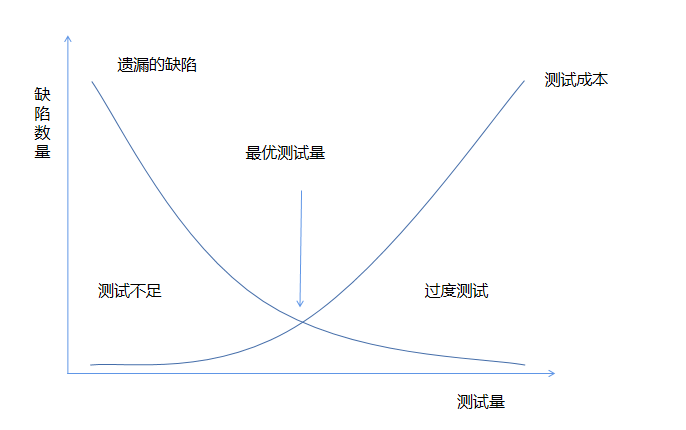
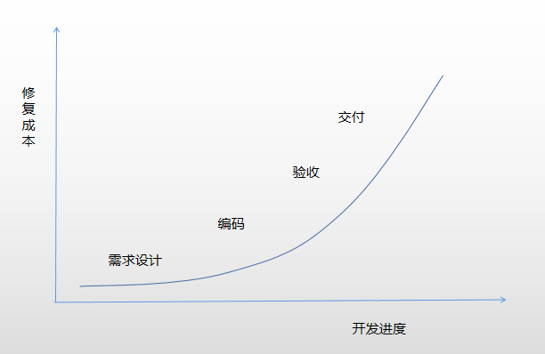

# 当面试官问你，软件测试有哪些经验原则的时候

[toc]

> 原则是最重要的，所有的措施都应该在这个原则指导下进行。软件测试中有哪些原则呢？

### 1.软件测试需要专职的测试人员

程序员应避免测试自己的程序，为达到最佳的效果，应由第三方来进行测试。测试是带有 ”挑剔性” 的行为，心理状态是测试自己程序的障碍。同时对于需求规格说明的理解产生的错误也很难在程序员本人测试时被发现。

### 2.不要总是报告坏消息

当时开口总是报告坏消息，别人就会对你避之不及；

不要一发现缺陷就大肆宣扬，这样会令人厌恶；

不要兴冲冲地跑到程序员面前告诉他你的代码有缺陷，程序员会本能地产生抵触心理。

###  3.测试前制定好质量标准

有了质量标准，才能依据测试的结果对产品的质量进行正确的分析和评估，例如，进行性能测试前，应定义好产品性能的相关的各种指标。同样，测试用例应确定预期输出结果，如果无法确定测试结果，则无法进行校验。

### 4.穷举测试是不可能的

主要有4个原因：

- 输入量太大

- 输出结果太多

- 软件执行路径太多

- 软件需求规格说明书是主观的，缺陷的判定永远有争议

一旦你划分了等价类，就意味着有很多处于同一个等价类的测试用例被你忽略掉了，测试就是不再是穷举测试。

### 5.软件测试是有风险的

软件想要保证不出任何问题就需要对所有情况进行充分的测试，但是对于复杂的软件，测试用例将会是天文数字，在有限的时间内测试这些情况，是一件很不现实事情。软件的按时交付和完全测试之间有着天然的矛盾，因此，选择了不测试所有的情况，那就意味着风险。

上图展示了软件测试量和发现的缺陷之间的关系。

那么对于每一个项目来讲，都有一个最优的软件测试量。软件测试人员需要找到最优测试量。

### 6.软件缺陷及早发现，及早修复

测试人员一般在需求阶段就开始介入，使缺陷在需求或设计阶段就被发现，缺陷发现越早，修复的成本就越小。

上图展示了不同时期修复缺陷的成本

### 7.软件测试不能揭示潜伏的缺陷

软件测试人员只能证明软件存在缺陷，却不能证明软件不存在缺陷。当你认为测试已经足够充分的时候，只要继续投入成本测试，总能够继续发现缺陷。无论如何，你都是不能证明软件不存在缺陷的。

### 8.缺陷集群性

软件测试中存在Pareto原则：80%的缺陷发现在20%的模块中。为什么会这样呢？

- 程序员也有状态不好的时候，写了一个bug，就有可能写了第二个bug；

- 程序员可能会反复犯同样的错误，因为人都是有坏习惯，习惯不容易被改变；

- 当软件的设计出现问题时，往往会带来一连串的缺陷。

### 9.软件测试的杀虫剂效应

测试越多，bug对测试免疫越强，就越不容易发现软件的bug。就像害虫对杀虫剂产生了抗体一样，杀虫剂会慢慢地失效。

为了克服软件测试的杀虫剂效应，必须不断地采用不同的测试方法，编写不同的测试程序来测试软件，才能找出更多的软件缺陷。

### 10.并非所有的软件缺陷都需要修复

- 没有足够的时间：大多数情况下，软件的功能太多，开发和测试人员太少，没有足够的时间来充分测试软件和修复缺陷

- 不算真正的软件缺陷：很多情况下，理解差异，测试错误，需求变更，软件的缺陷认定标准会变化。

- 修复的成本太大：遗憾的是，这种情况非常常见，软件本身是脆弱的，崩溃是常态，没有错误才是少数情况。修复一个缺陷，可能会带来其他缺陷，在没有足够的时间和把握下，贸然修复缺陷会带来极大的风险。此时，不去修复缺陷，不失为一个明智的选择。

- 缺陷不值得修复：虽然软件存在缺陷，但是这是一个极少数情况下才会发生的缺陷，用户一般不会使用到，或者有额外的方式去规避。此时的缺陷也可以不用修复。

### 11.软件测试没有尽头

行业变化太快，去年的软件，今年就过时了，软件的需求说明书也在不断的变化，软件的功能也在不断地丰富，软件的设计也在不断地革新，软件的测试就没有尽头。

### 12.附录

##### 12.1 缺陷的判定

如果一个缺陷，程序员没有发现，测试员没有发现，用户也没有发现，那么这个缺陷到底算不算缺陷呢？

缺陷判定的原则：

- 软件并未实现产品说明书要求的功能
- 软件出现了产品说明书指明不应该出现的错误
- 软件实现说明书中未提到的功能
- 软件未实现产品说明书中虽然未明确提到但是应该实现的功能
- 软件难以理解，不易使用，运行速度慢，或者测试人员认为用户体验不好的情况

### 13.参考文献

1. 《软件测试》（美）Ron Patton 著  张小松 王珏 曹跃 等译
2. 软件测试的七个原则 https://blog.csdn.net/xjh257/article/details/80600554
3. 软件测试的十大原则 https://www.csdn.net/gather_25/MtTagg4sMTIzMC1ibG9n.html